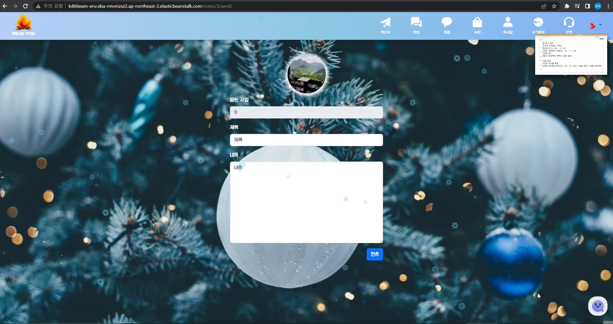
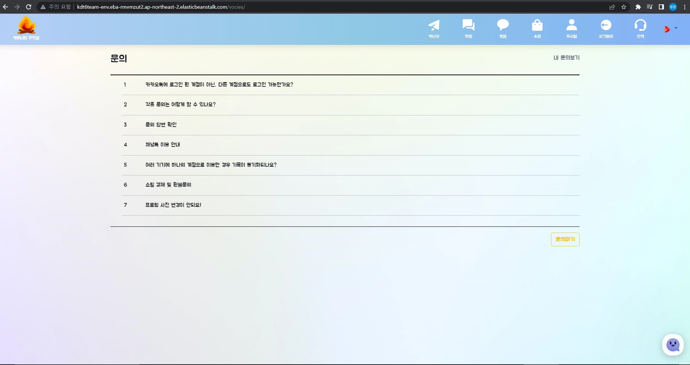
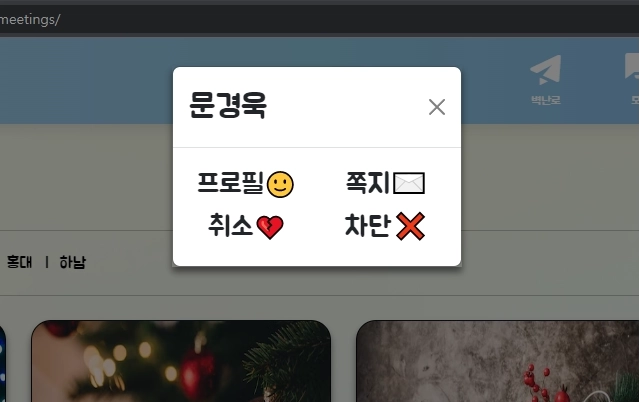
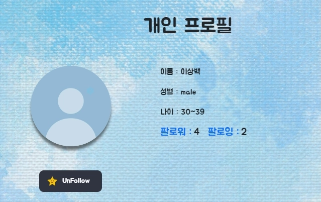
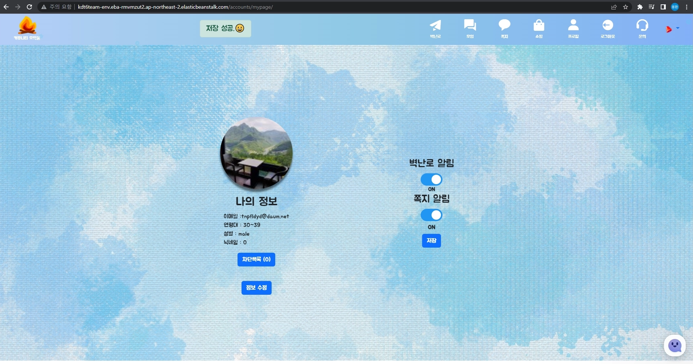
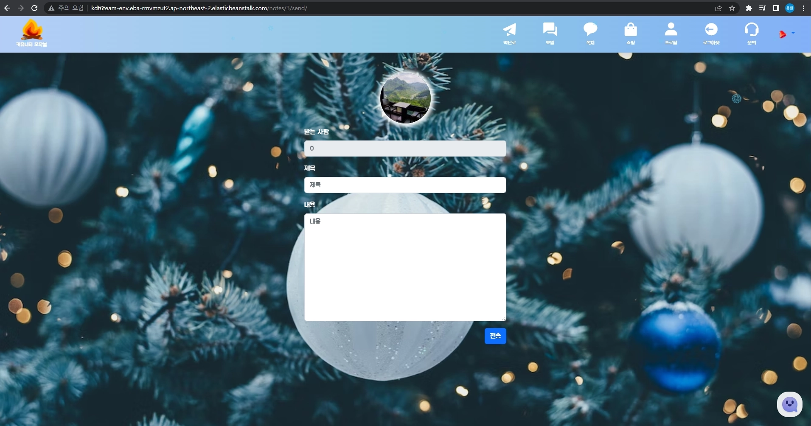

# 선택 프로젝트 II 명세서

## 프로젝트 목적

<aside>
🎯 웹 프레임워크 Django와 HTML / CSS / JavaScript를 활용해서 콘텐츠 기반 커뮤니티 웹 플랫폼 서비스를 개발합니다.

</aside>

## 프로젝트 일정

| 날짜 | 내용 |
| --- | --- |
| 11.9 (수) ~ 11.21 (월) | 프로젝트 개발 |
| 11.22 (화) | (오전) 프로젝트 발표회
(오후) 프로젝트 발표회 & 정리 |

## 프로젝트 주제

<aside>
🗂️ 콘텐츠 정보 제공 및 후기 공유 커뮤니티 서비스를 개발합니다.
아래 네 개의 주제 중 하나의 주제를 선택해서 프로젝트를 진행합니다.

</aside>

| 주제 | 예시 |
| --- | --- |
| 여행지 정보 및 후기 공유 커뮤니티 서비스 | 인스타그램 |
| 맛집 정보 및 후기 공유 커뮤니티 서비스 | 망고플레이트 |
| 영화 정보 및 후기 공유 커뮤니티 서비스 | 키노라이츠 |
| 상품 정보 및 후기 공유 커뮤니티 서비스 | 오늘의집 |

## 선택한 주제
- 상품 정보 및 후기 공유 커뮤니티 서비스
  - 산타파이브를 오마주한 벽난로, 모임, 쇼핑 기능을 만든 사이트 (서비스 이름: 모닥불)
  - 배포 주소 http://kdt6team-env.eba-rmvmzut2.ap-northeast-2.elasticbeanstalk.com/

## 사용 기술

- Python, Django, HTML, CSS, Bootstrap5, JavaScript

## 맡은 역할

- 이용환(BE, 팀장)
  - shoppings app, notes app, vocies app(voices 앱인데 되돌리긴 늦어버려서.. 오타난 채로 진행함..)
  - 카카오톡 회원가입, 로그인, 로그아웃
  - 팔로우, 차단
  - 댓글, 쪽지 알림 기능
  - 네이버 쇼핑API, 카카오 API, 채널톡 API 활용

## 맡은 기능 소개


- shoppings app

  - 화면 예시

  

  

  - urls.py

  ```python
  from . import views
  from django.urls import path
  
  app_name = "shoppings"
  
  urlpatterns = [
      path("", views.index, name="index"), #메인 페이지
      path("search/", views.search, name="search"), #검색 했을 때 페이지
      path("<str:string>/sort/", views.ssort, name="sort"), #정확도, 최저가, 최고가, 날짜순으로 정렬시 사용
  ]
  
  ```

  

  - views.py

  ```python
  from django.shortcuts import render
  
  # Create your views here.
  import os, urllib.request, urllib.parse, requests
  from django.http import JsonResponse
  
  
  def index(request): # 메인 페이지. 크리스마스 이벤트 페이지 답게 메인 키워드는 크리스마스 트리로 설정 하여 네이버 쇼핑api 활용
  	keyword = "크리스마스 트리"
      client_id = os.getenv("NAVER_ID")
      client_secret = os.getenv("NAVER_SECRET")
      encText = urllib.parse.quote(keyword)
      url = "https://openapi.naver.com/v1/search/shop.json?query=" + encText
  
      headers = {
          "X-Naver-Client-Id": client_id,
          "X-Naver-Client-Secret": client_secret,
      }
      params = {
          "display": 100,#검색하여 나오는 갯수는 100개로 설정
          "start": 1, #만약 페이지를 나눌 경우 활용. 1부터 시작하여 100개, 101부터 시작하여 100개 식으로 활용 가능
      }
      response = requests.get(url, headers=headers, params=params).json()
      for i in response["items"]:
          i["title"] = i["title"].replace("<b>", "")
          i["title"] = i["title"].replace("</b>", "")
  
      return render(request, "shoppings/index.html", {"items": response["items"]})
  
  
  def search(request): #만약 검색어가 있다면 검색어로 검색 되도록 변경, 없다면 크리스마스 트리로 검색!
      if request.GET.get("keyword"):
          keyword = request.GET.get("keyword")
      else:
          keyword = "크리스마스 트리"
      client_id = os.getenv("NAVER_ID")
      client_secret = os.getenv("NAVER_SECRET")
      encText = urllib.parse.quote(keyword)
      url = "https://openapi.naver.com/v1/search/shop.json?query=" + encText
  
      headers = {
          "X-Naver-Client-Id": client_id,
          "X-Naver-Client-Secret": client_secret,
      }
      params = {
          "display": 100,
          "start": 1,
      }
      response = requests.get(url, headers=headers, params=params).json()
      for i in response["items"]:
          i["title"] = i["title"].replace("<b>", "")
          i["title"] = i["title"].replace("</b>", "")
      context = {
          "items": response["items"],
          "keyword": keyword,
      }
      return render(request, "shoppings/search.html", context)
  
  
  def ssort(request, string): #만약 사용자가 최저가, 최고가, 날짜순으로 정렬 할 경우 axios로 사용자가 클릭한 값으로 sorting 하도록 사용
      if request.GET.get("keyword"):
          keyword = request.GET.get("keyword")
      else:
          keyword = "크리스마스 트리"
      client_id = os.getenv("NAVER_ID")
      client_secret = os.getenv("NAVER_SECRET")
      encText = urllib.parse.quote(keyword)
      url = "https://openapi.naver.com/v1/search/shop.json?query=" + encText
  
      headers = {
          "X-Naver-Client-Id": client_id,
          "X-Naver-Client-Secret": client_secret,
      }
      params = {
          "display": 100,
          "start": 1,
          "sort": string,
      }
      response = requests.get(url, headers=headers, params=params).json()
      for i in response["items"]:
          i["title"] = i["title"].replace("<b>", "")
          i["title"] = i["title"].replace("</b>", "")
      return JsonResponse(response)
  ```

  - sort 작동 방식

  1. html 설정

  ```html
  <select class="form-select" aria-label="Default select example" style="width: 200px;" id="select">
      <!-- sim, asc, dsc, data 는 네이버 api 에서 요구하는 정렬 값 -->
      <option value="sim" selected>정확도순</option>
      <option value="asc">최저가순</option>
      <option value="dsc">최고가순</option>
      <option value="date">날짜순</option>
  </select>
  <!-- django에게 데이터를 받은 뒤 붙이는 div에 id 값 넣어주기 -->
  <div class="row row-cols-8 d-flex justify-content-center" id="card-div">
  <p id='keyword' style="display: none;">{{keyword}}</p>
  ```

  2. JavaScript 설정

  ```javascript
  // 1. id값 select change 이벤트 발생시 실행
  const select = document.querySelector('#select')
    select.addEventListener('change', function(event) {
      const target = event.target.value
      const keyword = document.querySelector('#keyword').innerText
      // 2. axios로 get 요청으로 보냄 파라미터는 사용자가 검색한 단어
      axios.get(`/shoppings/${target}/sort/`, {
        params: {'keyword': keyword},
      })
      .then(response => {
        // 3. 받은 데이터를 붙일 div Select 및 div 내용 삭제
        const cardDiv = document.querySelector('#card-div')
        removeAllchild(cardDiv)
        function removeAllchild(div) {
          while (div.hasChildNodes()) {
            div.removeChild(div.firstChild)
          }
        }
        // 4. 받은 데이터 처리
        const resdata = response.data.items
        for (let i = 0; i < resdata.length; i++) {
          const div = document.createElement('div')
          div.classList = "card mb-3 d-flex mb-3 p-0 btn-1"
          div.style = "max-width: 800px;"
          const div2 = document.createElement('div')
          div2.classList = 'row g-0'
          const div3 = document.createElement('div')
          div3.className = 'col-md-4'
          const img = document.createElement('img')
          img.src = resdata[i].image
          img.classList = "img-fluid rounded-start"
          img.style = "width: 210px; height: 200px;"
          const a = document.createElement('a')
          a.appendChild(img)
          a.href = resdata[i].link
          div3.appendChild(a)
          div2.appendChild(div3)
          const div4 = document.createElement('div')
          div4.className = 'col-md-8'
          const div5 = document.createElement('div')
          div5.className = 'card-body'
          const h5 = document.createElement('h5')
          h5.className = 'card-title'
          h5.innerText = resdata[i].title
          const p = document.createElement('p')
          p.classList = 'card-text text-danger'
          p.innerText = `${resdata[i].lprice} 원`
          const p2 = document.createElement('p')
          p2.innerText = `${resdata[i].mallName}`
          const p3 = document.createElement('p')
          p3.className = 'card-text'
          const a2 = document.createElement('a')
          a2.href = resdata[i].link
          a2.classList = 'text-light btn btn-secondary btn-sm'
          a2.innerText = '구매하러 가기'
          p3.appendChild(a2)
          div5.appendChild(h5)
          div5.appendChild(p)
          div5.appendChild(p2)
          div5.appendChild(p3)
          div4.appendChild(div5)
          div2.appendChild(div4)
          div.appendChild(div2)
          cardDiv.appendChild(div)
        }
      })
    })
  ```

  3. 사용자가 html 에서 검색 및 정렬 선택 > JavaScript 는 이벤트 발생시 axios로 django 에게 검색어, 정렬 방식 전송 > django 는 검색, 정렬 방식을 네이버 쇼핑 API 에게 전송 및 데이터 수신 후 JavaScript 에게 전송 > JavaScript 는 받은 데이터를 보여줄 div의 기존 내용 삭제 후 받은 데이터 출력 > 사용자 화면

  

- notes app

  - 화면 예시

  

  

  - urls.py

  ```python
  from . import views
  from django.urls import path
  
  app_name = "notes"
  
  urlpatterns = [
      path("", views.index, name="index"), # 메인 페이지
      path("<int:pk>/send/", views.send, name="send"), # 전송
      path("<int:pk>/", views.detail, name="detail"), # 상세보기 페이지
      path("<int:pk>/delete/", views.delete, name="delete"), # 삭제
  ]
  
  ```

  

  - views.py

  ```python
  from django.shortcuts import render, redirect, get_object_or_404
  from .models import *
  from django.contrib.auth import get_user_model
  from django.contrib.auth.decorators import login_required
  from django.contrib import messages
  from .forms import *
  from django.http import JsonResponse
  
  
  @login_required
  def index(request):
      notes = request.user.user_to.order_by("-created_at") #최신순 으로 정렬
      to_notes = request.user.user_from.order_by("-created_at")
      return render(
          request,
          "notes/index.html",
          {"notes": notes, "to_notes": to_notes},
      )
  
  
  @login_required
  def send(request, pk):
      notes = request.user.user_to.order_by("-created_at")
      to_user = get_object_or_404(get_user_model(), pk=pk)
      form = NotesForm(request.POST or None)
      if form.is_valid():
          temp = form.save(commit=False)
          temp.from_user = request.user
          temp.to_user = to_user
          temp.save()
          if to_user.note_notice:
              to_user.notice_note = False
              to_user.save()
          messages.success(request, "쪽지 전송 완료.😀")
          return redirect("meetings:index")
      context = {
          "notes": notes,
          "form": form,
          "to_user": to_user,
      }
      return render(request, "notes/send.html", context)
  
  
  def detail(request, pk):
      note = get_object_or_404(Notes, pk=pk)
      if request.user == note.to_user:
          if not note.read:
              note.read = True
              note.save()
          if not request.user.user_to.filter(read=False).exists():
              request.user.notice_note = True
              request.user.save()
          return render(request, "notes/detail.html", {"note": note})
      elif request.user == note.from_user:
          return render(request, "notes/detail.html", {"note": note})
      else:
          messages.error(request, "그렇게는 볼 수 없어요.😅")
          return redirect("notes:index")
  
  
  def delete(request, pk):
      note = get_object_or_404(Notes, pk=pk)
      if request.user == note.to_user and request.method == "POST":
          note.delete()
          return JsonResponse({"pk": pk})
      else:
          messages.error(request, "남의 쪽지는 지울 수 없어요.😅")
          return redirect("notes:index")
  ```

  - 삭제 작동 방식
    - 삭제 버튼 클릭시 사용자에게 쪽지를 삭제할지 confirm 창 출력 > 사용자가 확인을 누를 시 axios 로 삭제 할 쪽지의 pk 값과 csrf 토큰 전송 > django는 POST 와 삭제 본인이 쪽지를 받은 당사자인지 확인 후 삭제 및 javascrtipt 쪽으로 지워야 할 div의 id 값 전송 > javascript는 div 삭제

  ```html
  <tr id="{{note.pk}}">
    <td>
      
      {{note.from_user.nickname}}
      
      {{note.from_user.username}}
      
    </td>
    <td><a class="custom-link" style="text-decoration:none; color:black;" href="">{{ note.title }}</a></td>
    <td class="tc">{{ note.created_at|date:'o.m.d' }} {{ note.created_at|time:"H:i" }}</td> <!---보낸시간 -->
    
    <td>읽음</td>
    
    <td>안읽음</td>
    
    <td class="tc">
        
        <button id="custom-btn" style="background-color:transparent;">
            <!-- 모든 삭제 버튼에 이벤트 추가를 위해 onclick 사용 -->
          <i xmlns="http://www.w3.org/2000/svg" width="22" height="22" fill="currentColor" class="bi bi-trash3" viewBox="0 0 16 16" data-note-id="{{note.pk}}" value="{{note.pk}}" onclick="remove(event)"></i>
        </button>
    </td>
  </tr>
  <script>
    function remove(event) {
    console.log(event.target.dataset.noteId)
    var delete_warning = confirm('쪽지를 삭제하시겠습니까?')
    const csrftoken = document.querySelector('[name=csrfmiddlewaretoken]').value
    if (delete_warning == true) {
      axios({
        method: 'post',
        url: `/notes/${event.target.dataset.noteId}/delete/`,
        headers: {'X-CSRFToken': csrftoken},
        data: {'note_pk': event.target.dataset.noteId},
      })
      .then(response => {
        const resdata = response.data.pk
        const div = document.getElementById(resdata)
        console.log(div)
        div.remove()
      })
    }
  }
  </script>
  ```

  

  

- vocies app
  
  
  
  - 화면 예시
  
  
  
  
  
  - urls.py
  
  ```python
  from django.urls import path
  from . import views
  
  app_name = "vocies"
  
  urlpatterns = [
      path("", views.index, name="index"), # 메인페이지
      path("myvocie/", views.myvocie, name="myvocie"), # 나의 문의
      path("create/", views.create, name="create"), # 문의 작성
      path("<int:pk>/update/", views.update, name="update"), # 문의 수정
      path("<int:pk>/", views.detail, name="detail"), # 문의 상세보기 페이지
      path("<int:pk>/comment/", views.comment, name="comment"), #문의 답변 작성
      path("manage_page/", views.manage_page, name="manage_page"), #모든 문의 볼 수 있는 페이지 관리자만 접근가능
      path("<int:pk>/<int:super_pk>/delete_comment/", views.delete_comment, name="delete_comment"), #답변 삭제
  ]
  ```
  
  
  
  - views.py
  
  ```python
  from django.shortcuts import render, redirect, get_object_or_404
  from django.contrib.auth.decorators import login_required, permission_required
  from .forms import *
  from .models import *
  from django.contrib import messages
  
  # Create your views here.
  
  
  def index(request):
      return render(request, "vocies/index.html")
  
  
  @login_required
  def myvocie(request):
      return render(request, "vocies/myvocie.html", {"vocies": request.user.vocies.all()})
  
  
  @login_required
  def create(request):
      form = VocieForm(request.POST or None, request.FILES or None)
      if form.is_valid():
          temp = form.save(commit=False)
          temp.user = request.user
          temp.save()
          return redirect("vocies:index")
      return render(request, "vocies/create.html", {"form": form})
  
  
  @login_required
  def detail(request, pk):
      vocie = get_object_or_404(Vocie, pk=pk)
      if request.user == vocie.user or request.user.is_superuser:
          context = {
              "vocie": vocie,
              "form": CommentForm(),
              "comments": vocie.vocie_comment.all(),
          }
          return render(request, "vocies/detail.html", context)
      messages.warning(request, "작성자만 접근할 수 있습니다.")
      return redirect("vocies:index")
  
  @login_required
  def update(request, pk):
      vocie = get_object_or_404(Vocie, pk=pk)
      if request.user == vocie.user:
          if request.method == 'POST':
              form = VocieForm(request.POST, request.FILES, instance=vocie)
              if form.is_valid():
                  form.save()
                  return redirect("vocies:detail", vocie.pk)
          else:
              form = VocieForm(instance=vocie)
          return render(request, "vocies/update.html", {"form": form})
      else:
          messages.warning(request, "작성자만 수정할 수 있습니다.")
          return redirect("vocies:detail", pk)
  
  
  @login_required
  def comment(request, pk):
      if request.user.is_superuser:
          form = CommentForm(request.POST)
          if form.is_valid():
              temp = form.save(commit=False)
              temp.vocie = Vocie.objects.get(pk=pk)
              temp.manager = request.user
              temp.save()
              return redirect("vocies:detail", pk)
      messages.warning(request, "관리자만 접근할 수 있습니다.")
      return redirect("vocies:index")
  
  
  def delete_comment(request, pk, super_pk):
      if request.user.is_superuser:
          comment_delete = Comment.objects.get(pk=pk)
          comment_delete.delete()
      return redirect("vocies:detail", super_pk)
  
  
  @permission_required('vocies.index', raise_exception=True)
  def manage_page(request):
      return render(request, "vocies/manage_page.html", {"vocies": Vocie.objects.order_by("-pk")})
  
  ```
  
  
  
- 카카오톡 회원가입, 로그인, 탈퇴 views.py

  ```python
  def kakao_request(request):
      kakao_api = "https://kauth.kakao.com/oauth/authorize?response_type=code"
      redirect_uri = "http://localhost:8000/accounts/kakao/login/callback/"
      client_id = os.getenv("KAKAO_ID")
      return redirect(f"{kakao_api}&client_id={client_id}&redirect_uri={redirect_uri}")
  
  
  def kakao_callback(request):
      data = {
          "grant_type": "authorization_code",
          "client_id": os.getenv("KAKAO_ID"),
          "redirect_uri": "http://localhost:8000/accounts/kakao/login/callback/",
          "code": request.GET.get("code"),
          "client_secret": os.getenv("KAKAO_SECRET"),
      }
      kakao_token_api = "https://kauth.kakao.com/oauth/token"
      temp = requests.post(kakao_token_api, data=data).json()
      access_token = temp["access_token"]
  
      headers = {"Authorization": f"bearer ${access_token}"}
      kakao_user_api = "https://kapi.kakao.com/v2/user/me"
      kakao_user_information = requests.get(kakao_user_api, headers=headers).json()
      kakao_id = kakao_user_information["id"]
      kakao_nickname = kakao_user_information["properties"]["nickname"]
      kakao_profile_image = kakao_user_information["properties"]["profile_image"]
      kakao_email = kakao_user_information["kakao_account"].get("email")
      kakao_age_range = kakao_user_information["kakao_account"].get("age_range")
      kakao_gender = kakao_user_information["kakao_account"].get("gender")
  
      if get_user_model().objects.filter(username=kakao_id).exists():
          kakao_user = get_user_model().objects.get(username=kakao_id)
          kakao_user.refresh_token = temp["refresh_token"]
          kakao_user.profileimage = kakao_profile_image
          kakao_user.save()
      else:
          kakao_login_user = get_user_model().objects.create(
              username=kakao_id,
              nickname=kakao_nickname,
              profileimage=kakao_profile_image,
              email=kakao_email,
              age_range=kakao_age_range,
              gender=kakao_gender,
              refresh_token=temp["refresh_token"],
          )
          kakao_login_user.set_password(str(state_token))
          kakao_login_user.save()
          kakao_user = get_user_model().objects.get(username=kakao_id)
      auth_login(request, kakao_user, backend="django.contrib.auth.backends.ModelBackend")
      if request.user.blockers.count() > 9:
          auth_logout(request)
          messages.error(request, "누적 신고 횟수가 많아 로그인 할 수 없어요.😥")
      else:
          messages.success(request, "오신걸 환영합니다.😀")
      return redirect(request.GET.get("next") or "home")
  
  
  def delete(request):
      url = "https://kauth.kakao.com/oauth/token"
  
      data = {
          "grant_type": "refresh_token",
          "client_id": os.getenv("KAKAO_ID"),
          "refresh_token": request.user.refresh_token,
          "client_secret": os.getenv("KAKAO_SECRET"),
      }
  
      response = requests.post(url, data=data).json()
      access_token = response["access_token"]
      url = "https://kapi.kakao.com/v1/user/unlink"
      headers = {
          "Content-Type": "application/x-www-form-urlencoded",
          "Authorization": f"Bearer ${access_token}",
      }
      response = requests.post(url, headers=headers)
      request.user.delete()
      auth_logout(request)
      return redirect("accounts:index")
  ```


- follow, block

  

  - 화면 예시

  

  

  

  - views.py

  ```python
  @login_required
  def follow(request, pk):
      person = get_object_or_404(get_user_model(), pk=pk)
      if person != request.user and request.method == "POST":
          if person.followers.filter(pk=request.user.pk).exists():
              person.followers.remove(request.user)
              is_follow = False
          else:
              person.followers.add(request.user)
              is_follow = True
          context = {
              "isFollow": is_follow,
              "followersCount": person.followers.all().count(),
              "followingsCount": person.followings.all().count(),
          }
          return JsonResponse(context)
      else:
          messages.warning(request, "그건 안됨.")
          return redirect("meetings:index")
      
  @login_required
  def block(request, pk):
      person = get_object_or_404(get_user_model(), pk=pk)
      if person != request.user and request.method == "POST":
          if person.blockers.filter(pk=request.user.pk).exists():
              person.blockers.remove(request.user)
              is_follow = False
              messages.success(request, "차단이 해제되었습니다.")
          else:
              person.blockers.add(request.user)
              is_follow = True
              messages.success(request, "차단 되었습니다.")
          context = {
              "isFollow": is_follow,
          }
          return JsonResponse(context)
      else:
          messages.warning(request, "그건 안됨.")
          return redirect("meetings:index")
  
  ```

  

  - JavaScript

  ```javascript
    // onclick 함수 사용
    function follow(event) {
    const csrftoken = document.querySelector('[name=csrfmiddlewaretoken]').value
      axios({
        method: 'post',
        url: `/accounts/${event.target.dataset.userId}/follow/`,
        headers: {'X-CSRFToken': csrftoken},
        data: {'note_pk': event.target.dataset.userId},
      })
      .then(response => {
        if (response.data.isFollow === true) {
          const e = event.target
          const span = document.createElement('span')
          e.innerText = '취소'
          span.innerText = '💔'
          span.className = 'fs-4'
          e.appendChild(span)
        }
        else {
          const e = event.target
          const span = document.createElement('span')
          e.innerText = '팔로우'
          span.innerText = '❤️'
          span.className = 'fs-4'
          e.appendChild(span)
        }
      })
    }
    function block(event) {
    const csrftoken = document.querySelector('[name=csrfmiddlewaretoken]').value
      axios({
        method: 'post',
        url: `/accounts/${event.target.dataset.userId}/block/`,
        headers: {'X-CSRFToken': csrftoken},
        data: {'note_pk': event.target.dataset.userId},
      })
      .then(response => {
        if (response.data.isFollow === true) {
          const e = event.target
          const span = document.createElement('span')
          e.innerText = '취소'
          span.innerText = '⭕'
          span.className = 'fs-4'
          e.appendChild(span)
        }
        else {
          const e = event.target
          const span = document.createElement('span')
          e.innerText = '차단'
          span.innerText = '❌'
          span.className = 'fs-4'
          e.appendChild(span)
        }
      })
    }
  ```

  

- 벽난로(쪽지), 알림 기능


  - 화면 예시
  - 작동 방식
    1. 모델 설정 (사용자가 on/off 가 가능하도록)
    2. 쪽지나 벽난로(댓글)이 달렸을 경우 받는 사람의 알림에 표시
    3. 사용자가 알림을 둘 중의 하나라도 켜뒀을 때, 알림을 모두 꺼두었을 때 템플릿에서 어떻게 보일지 조절
    4. 사용자가 알림을 알림을 켜 두었을 때 새로운 알림이 있으면 종의 모양을 바꿔주고 사용자가 클릭하는 순간 JavaScript 실행
    5. axios 가 django 에게 데이터를 달라고 요청
    6. django는 [시간, 내용, 보낸사람, 어디서 온건지, 알림을 클릭하면 보낼 곳의 데이터] 를 시간순으로 정렬하여 전송 
    7. Javascript는 받은 데이터를 벽난로와 쪽지로 구분하여 알림 div에 출력

  

  


  - models.py

  ```python
  # 기능 소개에 불필요한 내용은 삭제했습니다.
  class User(AbstractUser):
      tree_notice = models.BooleanField(default=True) # 벽난로 알림 on/off 사용자 선택의 영역
      note_notice = models.BooleanField(default=True) # 쪽지 알림 on/off 사용자 선택의 영역
      notice_tree = models.BooleanField(default=True) # False 시 새로운 내용이 있음
      notice_note = models.BooleanField(default=True) # False 시 새로운 내용이 있음
  # 벽난로(댓글)
  class UserComment(models.Model):
      read = models.BooleanField(default=False) # 읽음은 True, 안 읽음은 False로 처리
  # 쪽지
  class Notes(models.Model):
      read = models.BooleanField(default=False) # 읽음은 True, 안 읽음은 False로 처리
  ```

  - views.py (쪽지 보내는 곳과, 벽난로(댓글) 다는 곳에 아래의 설정 추가)

  ```python
  @login_required
  def send(request, pk):
      # -------중략--------
      if to_user.note_notice: # 만약 받는 사람의 알림이 켜져 있다면,
          to_user.notice_note = False # 받는 사람의 새로운 내용이 있다는 것을 표시
          to_user.save() # 저장
  ```

  - html 설정

  ```html
  <li class="nav-item dropdown d-flex align-items-center">
    
      
        <a class="nav-link dropdown-toggle" href="#" role="button" data-bs-toggle="dropdown" aria-expanded="false">
          
        </a>
        <ul class="dropdown-menu p-0" style="background: rgba(0, 0, 0, 0.0); border: none;">
          <li class="p-3 dropdown-item">새로운 알림이 <br> 없어요😊</li>
        </ul>
      
        <a class="nav-link dropdown-toggle" href="#" role="button" data-bs-toggle="dropdown" aria-expanded="false" onclick="apen(event)">
          
        </a>
        
        <ul class="dropdown-menu p-0" id="dropul" style="background: rgba(0, 0, 0, 0.0); border: none;">
        </ul>
      
    
      <a class="nav-link dropdown-toggle" href="#" role="button" data-bs-toggle="dropdown" aria-expanded="false">
        🔕
      </a>
      <ul class="dropdown-menu p-0" style="background: rgba(0, 0, 0, 0.0); border: none;">
        <li class="p-3 dropdown-item">알림을 켜두면 <br>새로운 알림을 <br> 받을 수 있어요😊</li>
      </ul>
    
  </li>
  ```

  - JavaScript

  ```javascript
  function apen(event) {
    const csrftoken = document.querySelector('[name=csrfmiddlewaretoken]').value
    axios({
      method: 'post',
      url: '/accounts/notice/',
      headers: {'X-CSRFToken': csrftoken},
    })
    .then(response => {
      const items = response.data.items
      const dropul= document.querySelector("#dropul")
      removeAllchild(dropul)
      function removeAllchild(div) {
        while (div.hasChildNodes()) {
          div.removeChild(div.firstChild);
        }
      };
      if (items.length > 0) {
        for (let i=0; i<items.length; i++) {
          let time = moment(items[i][0]).add(9, 'hours').format('YYYY년 MM월 D일, a h:mm:ss');
          if (items[i][1][2] === 'card') {
            const li = document.createElement('li')
            const a = document.createElement('a')
            a.classList='dropdown-item mt-3'
            a.href = ``
            a.href = a.href.replace('1', items[i][1][3])
            const p = document.createElement('p')
            const h6 = document.createElement('h6')
            h6.innerText = time
            p.innerText = `${items[i][1][1]} 님이 벽난로 ${items[i][1][0]} 을 남겼어요.`
            p.className = 'mb-0'
            a.appendChild(h6)
            a.appendChild(p)
            li.appendChild(a)
            dropul.appendChild(li)
          }
          else {
            const li = document.createElement('li')
            const a = document.createElement('a')
            a.classList='dropdown-item mt-3'
            a.href = ``
            a.href = a.href.replace('1', items[i][1][3])
            const p = document.createElement('p')
            const h6 = document.createElement('h6')
            h6.innerText = time
            p.innerText = `${items[i][1][1]} 님이 ${items[i][1][0]} 쪽지를 보냈어요.`
            p.className = 'mb-0'
            a.appendChild(h6)
            a.appendChild(p)
            li.appendChild(a)
            dropul.appendChild(li)
          }
        }
      }
      else {
        const li = document.createElement('li')
        li.classList = 'p-3 dropdown-item'
        li.innerText = '알림이 없어요😊'
        dropul.appendChild(li)
      }
    })
  }
  ```

  - 데이터 가져오는 views.py

  ```python
  @login_required
  def notice(request):
      if request.method == "POST":
          dic = {}
          if request.user.tree_notice:
              if UserCard.objects.filter(user=request.user).exists():
                  card = request.user.usercard
                  false_comments = card.usercomment_set.filter(read=False)
                  for i in false_comments:
                      if i.created_at not in dic:
                          dic[i.created_at.strftime("%Y-%m-%dT%H:%M:%S")] = (
                              i.content,
                              i.user.nickname,
                              "card",
                              card.pk,
                          ) # [시간, 내용, 보낸사람, 어디서 온건지, 알림을 클릭하면 보낼 곳의 데이터 전송]
                      else: #시간을 조절하는 행동을 하고싶어서 해본... 없어도 로직의 문제는 없음
                          dic[
                              (i.created_at + datetime.timedelta(minutes=1)).strftime(
                                  "%Y-%m-%dT%H:%M:%S"
                              )
                          ] = (
                              i.content,
                              i.user.nickname,
                              "card",
                              card.pk,
                          )
          if request.user.note_notice:
              if request.user.user_to.filter(read=False).exists():
                  false_notes = request.user.user_to.filter(read=False)
                  for i in false_notes:
                      if i.created_at not in dic:
                          dic[i.created_at.strftime("%Y-%m-%dT%H:%M:%S")] = (
                              i.title,
                              i.from_user.nickname,
                              "note",
                              i.pk,
                          )
                      else: # 마찬가지로 시간을 조절한 행동
                          dic[
                              (i.created_at + datetime.timedelta(minutes=1)).strftime(
                                  "%Y-%m-%dT%H:%M:%S"
                              )
                          ] = (i.title, i.from_user.nickname, "note", i.pk)
          dic = sorted(dic.items(), reverse=True) #시간 순으로 정렬
          if not dic:
              request.user.notice_tree = True
              request.user.notice_note = True
              request.user.save()
          return JsonResponse({"items": dic})
      else:
          messages.error(request, "그렇게는 접근할 수 없어요.😥")
          return redirect("meetings:index")
  ```

## 새로써본 기능

- API, SCSS, templatetags

## 프로젝트 느낀 점

- API 문서를 읽는 방법에 대해 계속 읽어보니 어느정도 API 사용법에 대해 알게됐고, SCSS 문법에 대해서도 배울 수 있어서 좋았습니다. 

  기존에 axios를 쓴다 하면 팔로우, 댓글, 좋아요 정도만 사용했었는데 다양하게 사용해보니 너무 편하다라는 것을 느낄 수 있었고,

  짧은 시간안에 인터넷 및 같은 팀원들의 코드를 보며 다른 사람들의 생각을 많이 배울 수 있었습니다.

  많은 것을 구현하진 못했지만, 내가 원하는 기능을 내가 만들 수 있다는 것에 너무 좋았습니다.
